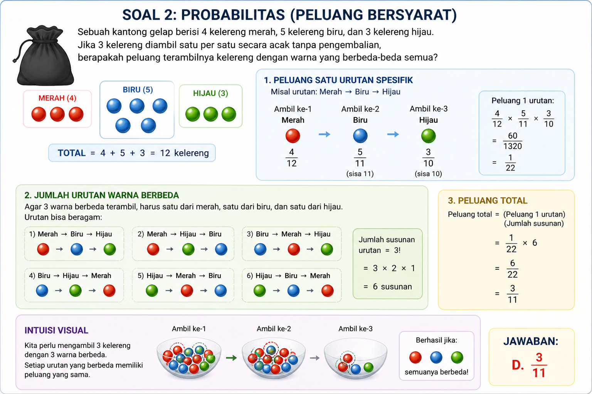

# M4/W4/D32 - Sat, 02 May 2026 (WIB)

## Scholastic Kuantitatif / Numerik - Curriculum

Kurikulum kuantitatif Tes Skolastik LPDP untuk membangun kemampuan membaca
pola angka, operasi dasar, pecahan, persentase, rasio, aljabar, geometri,
kombinatorika, modular, peluang, himpunan, rata-rata, dan laju kerja.
File ini dibuat sebagai satu tempat belajar: setiap nomor berisi konsep, pola
soal, pola menjawab, jebakan umum, aturan review, dan latihan langsung di dalam
curriculum.

Target audience: peserta yang ingin mulai dari basic banget, lalu naik ke pola
numerik yang sering muncul di Tes Bakat Skolastik.

---

## Curriculum Table

| #   | Topic                      | Core Concept                                               | LPDP Usage                                                     |
| --- | -------------------------- | ---------------------------------------------------------- | -------------------------------------------------------------- |
| 01  | Deret Angka                | Pola bilangan dari selisih, rasio, atau operasi berulang   | Menebak angka berikutnya dengan pola yang paling konsisten     |
| 02  | Aritmetika Dasar           | Urutan operasi tambah, kurang, kali, bagi                  | Menghitung cepat tanpa salah prioritas operasi                 |
| 03  | Pecahan & Desimal          | Konversi dan operasi pecahan/desimal                       | Menyamakan bentuk angka agar hitungan lebih ringan             |
| 04  | Persentase                 | Diskon, kenaikan, penurunan, dan faktor pengali            | Menghindari jebakan persen beruntun                            |
| 05  | Perbandingan               | Rasio, proporsi, skala, dan campuran                       | Mengubah bagian rasio menjadi nilai nyata                      |
| 06  | Aljabar Sederhana          | Persamaan satu/dua variabel                                | Membuat model dari informasi numerik                           |
| 07  | Laju, Jarak, dan Pekerjaan | Kecepatan relatif, laju gabungan, dan waktu kerja          | Menghitung susul-menyusul, saling mendekat, dan proyek bersama |
| 08  | Geometri Dasar             | Luas segitiga sama sisi, lingkaran dalam, dan selisih area | Menghitung daerah gabungan atau sisa dalam bentuk akar dan pi  |
| 09  | Kombinatorika Dasar        | Kombinasi tanpa urutan dan syarat minimal                  | Menghitung banyak susunan tim atau pilihan terbatas            |
| 10  | Aritmetika Modular         | Siklus sisa pembagian pada pangkat besar                   | Menjawab eksponen besar tanpa menghitung nilainya penuh        |
| 11  | Peluang Dasar              | Ruang sampel dan jumlah kejadian                           | Menghitung peluang dadu, kartu, atau pilihan acak              |
| 12  | Himpunan Kuantitatif       | Gabungan, irisan, hanya A, dan tidak keduanya              | Menjawab survei dua kategori dengan data overlap               |
| 13  | Rata-rata dan Statistik    | Total nilai, jumlah data, dan perubahan rata-rata          | Menghitung rata-rata baru setelah data ditambah/dihapus        |

---

## Grind Plan

| Urutan | Fokus                       | Target      | Output                                                      |
| ------ | --------------------------- | ----------- | ----------------------------------------------------------- |
| 01-03  | Pola dan operasi angka      | Nomor 01-03 | Catatan pola, urutan operasi, dan konversi                  |
| 04-05  | Persen dan rasio            | Nomor 04-05 | Catatan basis persen, total bagian, dan model campuran      |
| 06-08  | Aljabar, laju, dan geometri | Nomor 06-08 | Catatan persamaan, timeline, satuan, dan rumus luas         |
| 09-13  | Topik matematika lanjutan   | Nomor 09-13 | Catatan kombinasi, modulo, peluang, himpunan, dan rata-rata |

Aturan waktu:

- Nomor 01-03: 60-120 detik per soal.
- Nomor 04-05: 2-4 menit per soal.
- Nomor 06-08: 2-4 menit per soal.
- Nomor 09-13: 2-4 menit per soal.
- Review wajib mencatat letak salah: salah pola, salah operasi, salah model,
  salah satuan, salah rumus kombinasi, salah siklus modulo, salah ruang sampel,
  salah irisan, salah total nilai, atau salah hitung.

## Prompt 
``` 
Classify these questions by topic and insert each one into the right `NumXX` domain section in `learn-scholastic-test/quantitative-curriculum.md` as practice questions. Keep each answer and explanation under its question. Do not make a mixed simulation section. Only create a new topic section if no existing domain fits.

```

---

## Num01 - Deret Angka

### The Problem

Soal deret angka terlihat seperti tebak-tebakan, padahal yang diuji adalah
kemampuan menemukan pola paling sederhana dan paling konsisten. Kesalahan umum:
melihat satu selisih cocok, lalu langsung memilih jawaban tanpa mengecek seluruh
barisan.

Contoh pola dasar:

```text
3, 7, 15, 31, 63, ...
```

Setiap angka dikali 2 lalu tambah 1:

```text
3 x 2 + 1 = 7
7 x 2 + 1 = 15
15 x 2 + 1 = 31
31 x 2 + 1 = 63
```

### The Concept

Deret angka bisa memakai beberapa jenis pola. Jangan hafal satu pola saja.

| Pola               | Bentuk Cepat                               | Contoh          |
| ------------------ | ------------------------------------------ | --------------- |
| Selisih tetap      | tambah angka yang sama                     | 4, 9, 14, 19    |
| Rasio tetap        | kali angka yang sama                       | 3, 6, 12, 24    |
| Selisih bertingkat | selisihnya naik/turun berpola              | 2, 5, 10, 17    |
| Operasi berulang   | kali lalu tambah/kurang                    | 3, 7, 15, 31    |
| Pola selang-seling | posisi ganjil dan genap punya pola berbeda | 2, 10, 4, 20, 8 |

### Pattern of Question

```text
Barisan angka -> satu angka kosong/berikutnya -> opsi angka yang mirip
```

### Pattern to Answer

1. Cek selisih antar angka.
2. Kalau selisih tidak stabil, cek selisih tingkat dua.
3. Kalau masih tidak stabil, cek rasio atau operasi `x n + k`.
4. Cek apakah pola berlaku ke semua angka, bukan hanya dua angka terakhir.

```text
barisan -> pola antar angka -> verifikasi semua langkah -> angka berikutnya
```

### Common Traps

| Jebakan                    | Contoh                                                |
| -------------------------- | ----------------------------------------------------- |
| Hanya lihat angka terakhir | 63 ke opsi terdekat                                   |
| Salah pola selisih         | mengira selisihnya tambah tetap                       |
| Tidak verifikasi           | pola cocok di dua langkah, tapi gagal di langkah lain |

### Review Rule

Untuk setiap deret, wajib tulis pola dalam satu baris:

```text
Pola: setiap angka ...
```

### Practice Question

**Soal**  
Tentukan angka berikutnya:

```text
3, 7, 15, 31, 63, ...
```

A. 95  
B. 111  
C. 127  
D. 129  
E. 143

**Jawaban: C. 127**

**Pembahasan**  
Pola deret adalah dikali 2 lalu tambah 1.

```text
3 x 2 + 1 = 7
7 x 2 + 1 = 15
15 x 2 + 1 = 31
31 x 2 + 1 = 63
63 x 2 + 1 = 127
```

Jadi angka berikutnya adalah `127`.

**Latihan Tambahan - Operasi Berulang Bertingkat**

**Soal**  
Analisislah pola barisan bilangan berikut:

```text
3, 7, 16, 35, 74, ...
```

Berapakah bilangan yang tepat untuk mengisi suku selanjutnya dalam barisan
tersebut?

A. 148  
B. 151  
C. 153  
D. 157  
E. 162

**Jawaban: C. 153**

**Pembahasan**  
Pola barisan memakai operasi kali 2, lalu ditambah konstanta yang naik satu per
satu.

```text
3 x 2 + 1 = 7
7 x 2 + 2 = 16
16 x 2 + 3 = 35
35 x 2 + 4 = 74
```

Maka suku selanjutnya:

```text
74 x 2 + 5 = 153
```

---

## Num02 - Aritmetika Dasar

### The Problem

Soal aritmetika dasar sering salah bukan karena konsepnya sulit, tetapi karena
urutan operasi keliru atau hitungan mental terlalu cepat. Di Tes Skolastik,
angka sering dibuat agar bisa disederhanakan kalau urutannya benar.

Contoh:

```text
48 x 125 / 24 + 36 x 25
```

Jangan hitung dari kiri secara membabi buta. Sederhanakan bagian yang mudah.

### The Concept

Urutan operasi:

```text
kurung -> kali/bagi -> tambah/kurang
```

Untuk kali dan bagi yang sejajar, kerjakan dari kiri ke kanan atau sederhanakan
faktor yang jelas aman.

Trik angka yang sering membantu:

| Bentuk  | Nilai |
| ------- | ----- |
| 25 x 4  | 100   |
| 125 x 8 | 1.000 |
| 0,5     | 1/2   |
| 0,25    | 1/4   |
| 0,75    | 3/4   |

### Pattern of Question

```text
Ekspresi hitung campuran -> angka besar tapi bisa disederhanakan
```

### Pattern to Answer

```text
pecah ekspresi -> sederhanakan faktor -> hitung akhir
```

### Common Traps

| Jebakan               | Kenapa Salah                                 |
| --------------------- | -------------------------------------------- |
| Menjumlah dulu        | Tambah/kurang kalah prioritas dari kali/bagi |
| Tidak menyederhanakan | Hitungan jadi besar dan rawan salah          |
| Salah baca ribuan     | 1.150 bisa terbaca 115 kalau terburu-buru    |

### Review Rule

Setelah mengerjakan, cek ulang ekspresi dengan tanda kurung mental:

```text
(bagian kali/bagi) + (bagian kali/bagi)
```

### Practice Question

**Soal**  
Nilai dari:

```text
48 x 125 / 24 + 36 x 25
```

adalah:

A. 1.125  
B. 1.150  
C. 1.175  
D. 1.200  
E. 1.250

**Jawaban: B. 1.150**

**Pembahasan**  
Kerjakan kali dan bagi sebelum penjumlahan.

```text
48 x 125 / 24 = 48 / 24 x 125
                 = 2 x 125
                 = 250

36 x 25 = 900

250 + 900 = 1.150
```

Jadi hasilnya adalah `1.150`.

---

## Num03 - Pecahan & Desimal

### The Problem

Pecahan dan desimal sering menjebak karena bentuk angkanya campur. Peserta
sering mencoba menghitung semuanya sebagai desimal panjang, padahal beberapa
angka punya bentuk pecahan yang mudah.

Contoh:

```text
3/4 + 0,625 - 5/8 + 0,2
```

Karena `0,625 = 5/8`, bagian `0,625 - 5/8` saling menghapus.

### The Concept

Kunci pecahan dan desimal adalah menyamakan bentuk sebelum operasi.

Konversi penting:

| Desimal | Pecahan |
| ------- | ------- |
| 0,1     | 1/10    |
| 0,2     | 1/5     |
| 0,25    | 1/4     |
| 0,375   | 3/8     |
| 0,5     | 1/2     |
| 0,625   | 5/8     |
| 0,75    | 3/4     |

### Pattern of Question

```text
Pecahan + desimal campur -> bentuk angka perlu disamakan
```

### Pattern to Answer

1. Cari desimal yang punya pecahan mudah.
2. Samakan bentuk angka.
3. Sederhanakan bagian yang saling menghapus.
4. Baru hitung hasil akhir.

```text
desimal mudah -> pecahan setara -> sederhanakan -> hasil akhir
```

### Common Traps

| Jebakan                | Contoh                        |
| ---------------------- | ----------------------------- |
| Salah konversi         | 0,625 dianggap 6/25           |
| Semua dibuat desimal   | boleh, tapi rawan salah koma  |
| Tidak lihat pembatalan | 0,625 dan 5/8 sebenarnya sama |

### Review Rule

Sebelum menghitung, tulis bentuk yang kamu pilih:

```text
Mau dihitung sebagai pecahan atau desimal?
```

### Practice Question

**Soal**  
Nilai dari:

```text
3/4 + 0,625 - 5/8 + 0,2
```

adalah:

A. 17/20  
B. 9/10  
C. 19/20  
D. 1  
E. 21/20

**Jawaban: C. 19/20**

**Pembahasan**  
Ubah desimal yang mudah:

```text
0,625 = 5/8
0,2 = 1/5
```

Maka:

```text
3/4 + 0,625 - 5/8 + 0,2
= 3/4 + 5/8 - 5/8 + 1/5
= 3/4 + 1/5
= 15/20 + 4/20
= 19/20
```

---


## Num04 - Persentase

### The Problem

Soal persentase sering terlihat sederhana, tetapi jebakannya ada pada nilai
dasar. Kenaikan atau diskon tahap kedua biasanya dihitung dari nilai terbaru,
bukan dari nilai awal.

### The Concept

Persentase lebih aman dibaca sebagai faktor pengali.

```text
naik p% -> kali (1 + p/100)
turun p% -> kali (1 - p/100)
diskon p% -> kali (1 - p/100)
```

### Pattern of Question

```text
Nilai awal -> naik/turun/diskon bertahap -> bandingkan harga akhir
```

### Pattern to Answer

```text
ambil angka mudah -> ubah persen jadi faktor -> hitung tahap demi tahap
```

### Common Traps

| Jebakan                 | Kenapa Salah                                   |
| ----------------------- | ---------------------------------------------- |
| Menjumlah persen mentah | Naik 25% lalu turun 20% bukan otomatis naik 5% |
| Pakai nilai awal terus  | Diskon dihitung dari harga setelah kenaikan    |
| Salah faktor            | Diskon 20% berarti kali 0,8, bukan kali 0,2    |

### Review Rule

Untuk persen bertahap, tulis nilai setelah setiap tahap:

```text
awal -> tahap 1 -> tahap 2 -> akhir
```

### Practice Question

**Soal**  
Harga sebuah barang dinaikkan 25%, lalu diberi diskon 20% dari harga setelah
kenaikan. Harga akhir dibandingkan harga awal adalah:

A. Turun 5%  
B. Tetap  
C. Naik 2,5%  
D. Naik 5%  
E. Naik 10%

**Jawaban: B. Tetap**

**Pembahasan**  
Misalkan harga awal `100`.

```text
Naik 25% -> 100 x 1,25 = 125
Diskon 20% -> 125 x 0,8 = 100
```

Harga akhir kembali sama dengan harga awal, jadi jawabannya `tetap`.

**Latihan Tambahan - Untung, Markup, dan Diskon**

**Soal**  
Sebuah distributor menaikkan harga jual suatu perangkat keras sebesar 40% dari
harga perolehan awalnya. Distributor tersebut kemudian memberikan diskon promosi
sebesar 20% kepada mitra. Jika setelah dipotong diskon perangkat keras tersebut
dibayarkan seharga Rp112.000, berapakah marjin keuntungan riil yang dikantongi
distributor tersebut?

A. Rp8.000  
B. Rp10.000  
C. Rp12.000  
D. Rp14.000  
E. Rp16.000

**Jawaban: C. Rp12.000**

**Pembahasan**  
Misalkan harga beli adalah `H`.

```text
Harga label = 1,4H
Harga akhir setelah diskon 20% = 1,4H x 0,8 = 1,12H
```

Diketahui harga akhir Rp112.000.

```text
1,12H = 112.000
H = 100.000
```

Keuntungan riil:

```text
112.000 - 100.000 = 12.000
```

Jadi marjin keuntungan riil adalah Rp12.000.

---

## Num05 - Perbandingan

### The Problem

Soal perbandingan tidak selalu berbentuk `A : B`. Kadang muncul sebagai selisih
bagian, pembagian keuntungan proporsional, atau campuran yang sebagian diambil
lalu diganti bahan murni. Kuncinya adalah tahu bagian mana yang menjadi total,
bagian mana yang menjadi porsi, dan bagian mana yang berubah.

### The Concept

Rasio dibaca sebagai bagian. Kalau perbandingan `A : B : C = 2 : 5 : 8`, maka:

```text
A = 2x
B = 5x
C = 8x
```

Untuk pembagian proporsional:

```text
porsi orang = bagian orang / total bagian
nilai orang = porsi orang x total nilai
```

Untuk campuran replacement:

```text
ambil campuran -> komposisi keluar mengikuti rasio awal
ganti bahan murni -> tambahkan hanya bahan pengganti
bentuk rasio akhir -> selesaikan total
```

### Pattern of Question

```text
Rasio/saham/campuran -> total atau selisih diketahui -> cari nilai salah satu bagian
```

### Pattern to Answer

```text
ubah rasio jadi bagian -> hubungkan dengan total/selisih -> cari nilai nyata
```

Untuk campuran:

```text
Total wadah = T
X awal = bagian X / total bagian x T
Y awal = bagian Y / total bagian x T
```

### Common Traps

| Jebakan                               | Kenapa Salah                                            |
| ------------------------------------- | ------------------------------------------------------- |
| Memakai bagian sebagai nilai langsung | `2 : 5 : 8` masih bagian, bukan rupiah                  |
| Salah total bagian                    | Total bagian harus dijumlahkan dulu                     |
| Salah porsi proporsional              | Modal 300 dari total 1.000 berarti 30%, bukan 300%      |
| Salah campuran keluar                 | Yang keluar mengikuti rasio campuran, bukan bahan murni |

### Review Rule

Sebelum hitung, tulis:

```text
Total bagian:
Nilai 1 bagian:
Yang ditanya:
```

Untuk campuran, tambahkan:

```text
Yang keluar:
Yang masuk:
Rasio akhir:
```

### Practice Question

**Latihan 1 - Rasio Selisih**

**Soal**  
Perbandingan uang A : B : C adalah `2 : 5 : 8`. Jika selisih uang C dan A
adalah Rp180.000, jumlah uang mereka adalah:

A. Rp420.000  
B. Rp450.000  
C. Rp480.000  
D. Rp500.000  
E. Rp540.000

**Jawaban: B. Rp450.000**

**Pembahasan**  
Misalkan:

```text
A = 2x
B = 5x
C = 8x
```

Selisih C dan A:

```text
8x - 2x = 180.000
6x = 180.000
x = 30.000
```

Jumlah uang mereka:

```text
2x + 5x + 8x = 15x
15 x 30.000 = 450.000
```

Jadi jumlah uang mereka adalah `Rp450.000`.

**Latihan 2 - Pembagian Proporsional**

**Soal**  
Tiga investor, Pak Andi, Pak Budi, dan Pak Candra, masing-masing
menginvestasikan Rp200 juta, Rp300 juta, dan Rp500 juta dalam sebuah usaha.
Setahun kemudian, usaha menghasilkan keuntungan total Rp240 juta yang dibagi
proporsional berdasarkan modal. Berapa keuntungan yang diterima Pak Budi?

A. Rp52 juta  
B. Rp60 juta  
C. Rp72 juta  
D. Rp80 juta

**Jawaban: C. Rp72 juta**

**Pembahasan**  
Total investasi:

```text
200 + 300 + 500 = 1.000 juta
```

Porsi Pak Budi:

```text
300 / 1.000 = 30%
```

Keuntungan Pak Budi:

```text
30% x 240 juta = 72 juta
```

Jadi keuntungan yang diterima Pak Budi adalah `Rp72 juta`.

**Latihan 3 - Campuran Replacement**

**Soal**  
Sebuah wadah berisi campuran bahan kimia X dan Y dengan rasio `5 : 3`. Jika 16
liter campuran tersebut diambil dan diganti dengan 16 liter bahan kimia Y murni,
rasio bahan kimia X dan Y di dalam wadah bergeser menjadi `3 : 5`. Berapa liter
kapasitas total wadah tersebut?

A. 32 liter  
B. 40 liter  
C. 48 liter  
D. 56 liter  
E. 64 liter

**Jawaban: B. 40 liter**

**Pembahasan**  
Misalkan kapasitas total wadah adalah `T` liter.

Rasio awal `X : Y = 5 : 3`, jadi:

```text
X awal = 5/8 T
Y awal = 3/8 T
```

Saat 16 liter campuran diambil, yang keluar mengikuti rasio `5 : 3`:

```text
X yang keluar = 5/8 x 16 = 10
Y yang keluar = 3/8 x 16 = 6
```

Setelah itu, 16 liter Y murni ditambahkan. Maka:

```text
X akhir = 5/8 T - 10
Y akhir = 3/8 T - 6 + 16
        = 3/8 T + 10
```

Rasio akhir `X : Y = 3 : 5`:

```text
(5/8 T - 10) / (3/8 T + 10) = 3/5
5(5/8 T - 10) = 3(3/8 T + 10)
25/8 T - 50 = 9/8 T + 30
16/8 T = 80
2T = 80
T = 40
```

Jadi kapasitas total wadah adalah `40 liter`.

---

## Num06 - Aljabar Sederhana

> [!Persamaan Linear] Persamaan Linear
> Persamaan Linear

### The Problem

Soal aljabar sederhana sering salah karena peserta tidak memilih variabel yang
tepat atau terlalu cepat menghilangkan informasi. Padahal modelnya biasanya
cukup satu atau dua persamaan.

### The Concept

Aljabar dipakai untuk menyimpan nilai yang belum diketahui. Setelah model
terbentuk, gunakan substitusi atau eliminasi.

### Pattern of Question

```text
Dua hubungan angka -> satu nilai ditanya -> bentuk persamaan
```

### Pattern to Answer

```text
tulis persamaan -> isolasi salah satu variabel -> substitusi -> cek hasil
```

### Common Traps

| Jebakan                         | Kenapa Salah                                 |
| ------------------------------- | -------------------------------------------- |
| Salah substitusi                | Tanda minus sering berubah                   |
| Tidak cek kembali               | Nilai x dan y harus memenuhi semua persamaan |
| Menghitung mental terlalu cepat | Persamaan pendek tetap bisa salah tanda      |

### Review Rule

Setelah dapat nilai, masukkan lagi ke persamaan awal.

### Practice Question

**Soal**  
Jika:

```text
2x + 3y = 41
x + y = 16
```

maka nilai `x` adalah:

A. 5  
B. 6  
C. 7  
D. 8  
E. 9

**Jawaban: C. 7**

**Pembahasan**  
Dari persamaan kedua:

```text
x + y = 16
x = 16 - y
```

Substitusi ke persamaan pertama:

```text
2(16 - y) + 3y = 41
32 - 2y + 3y = 41
y = 9
```

Maka:

```text
x + 9 = 16
x = 7
```

**Latihan Tambahan - Identitas Aljabar**

**Soal**  
Diketahui sebuah persamaan aljabar:

```text
x + 1/x = 5
```

Berapakah nilai dari:

```text
x^4 + 1/x^4
```

A. 525  
B. 527  
C. 529  
D. 623  
E. 625

**Jawaban: B. 527**

**Pembahasan**  
Kuadratkan persamaan awal:

```text
(x + 1/x)^2 = 25
x^2 + 2 + 1/x^2 = 25
x^2 + 1/x^2 = 23
```

Kuadratkan kembali:

```text
(x^2 + 1/x^2)^2 = 23^2
x^4 + 2 + 1/x^4 = 529
x^4 + 1/x^4 = 527
```

---
### Visual


## Num07 - Laju, Jarak, dan Pekerjaan

### The Problem

Soal laju, jarak, dan pekerjaan menjebak bukan karena rumusnya sulit, tetapi
karena informasi waktu, jarak, kecepatan, dan durasi kerja sering masuk secara
bertahap. Kesalahan umum adalah langsung memakai total jarak atau total proyek
tanpa memperhatikan siapa mulai duluan, siapa berhenti lebih awal, atau apakah
objek saling mendekat.

### The Concept

Untuk soal jarak-waktu-kecepatan:

```text
jarak = kecepatan x waktu
waktu = jarak / kecepatan
```

Untuk pekerjaan bersama:

```text
laju kerja = 1 / waktu selesai sendiri
bagian kerja = laju kerja x lama bekerja
total bagian kerja = 1 proyek
```

Jika dua objek saling mendekat:

```text
kecepatan relatif = kecepatan 1 + kecepatan 2
```

Jika satu objek menyusul objek lain di rute yang sama:

```text
jarak awal = kecepatan objek pertama x jeda waktu
kecepatan relatif = kecepatan penyusul - kecepatan objek pertama
waktu menyusul = jarak awal / kecepatan relatif
```

### Pattern of Question

```text
jarak-waktu-kecepatan / laju kerja -> ada jeda mulai/berhenti -> tanya waktu bertemu/selesai
```

### Pattern to Answer

```text
hitung progres awal -> cari sisa jarak/proyek -> pakai kecepatan atau laju relatif -> tambah ke waktu mulai
```

### Common Traps

| Jebakan                   | Kenapa Salah                                                     |
| ------------------------- | ---------------------------------------------------------------- |
| Abaikan jeda mulai        | Mobil pertama sudah menempuh jarak sebelum mobil kedua bergerak  |
| Pakai satu kecepatan saja | Saat saling mendekat, kecepatannya dijumlah                      |
| Salah jenis relatif       | Saling mendekat dijumlah, menyusul dikurangkan                   |
| Lupa durasi kerja berbeda | Pekerja yang keluar lebih awal tidak boleh dihitung sampai akhir |
| Salah ubah jam            | 1,5 jam berarti 1 jam 30 menit                                   |

### Review Rule

Tulis timeline:

```text
08.00 -> 08.30 -> waktu bertemu
```

### Practice Question

**Latihan 1 - Saling Mendekat**

**Soal**  
Jarak kota A dan kota B adalah 180 km. Mobil pertama berangkat dari kota A
pukul 08.00 menuju kota B dengan kecepatan 60 km/jam. Mobil kedua berangkat dari
kota B pukul 08.30 menuju kota A dengan kecepatan 40 km/jam. Jika keduanya
melewati jalan yang sama, pukul berapa mereka bertemu?

A. 09.30  
B. 09.45  
C. 10.00  
D. 10.15  
E. 10.30

**Jawaban: C. 10.00**

**Pembahasan**  
Dari pukul 08.00 sampai 08.30, mobil pertama sudah berjalan 0,5 jam:

```text
60 x 0,5 = 30 km
```

Sisa jarak saat mobil kedua mulai bergerak:

```text
180 - 30 = 150 km
```

Karena kedua mobil saling mendekat, kecepatan relatifnya:

```text
60 + 40 = 100 km/jam
```

Waktu untuk bertemu setelah 08.30:

```text
150 / 100 = 1,5 jam
```

Maka mereka bertemu pada:

```text
08.30 + 1 jam 30 menit = 10.00
```

**Latihan 2 - Menyusul**

**Soal**  
Kereta P berangkat dari Stasiun Alpha ke Stasiun Beta dengan kecepatan konstan
60 km/jam pada pukul 08.00. Dari stasiun dan rute yang sama, Kereta Q
diberangkatkan menyusul pada pukul 09.30 dengan kecepatan konstan 90 km/jam.
Pada pukul berapakah Kereta Q akan menyejajari Kereta P?

A. 11.30  
B. 12.00  
C. 12.30  
D. 13.00  
E. 13.30

**Jawaban: C. 12.30**

**Pembahasan**  
Kereta P berangkat lebih dulu selama 1,5 jam:

```text
08.00 -> 09.30 = 1,5 jam
jarak awal P = 60 x 1,5 = 90 km
```

Kereta Q menyusul dari belakang, jadi gunakan selisih kecepatan:

```text
kecepatan relatif = 90 - 60 = 30 km/jam
```

Waktu yang dibutuhkan Q untuk menutup jarak 90 km:

```text
90 / 30 = 3 jam
```

Kereta Q mulai pukul 09.30, maka:

```text
09.30 + 3 jam = 12.30
```

Jadi Kereta Q menyejajari Kereta P pada pukul `12.30`.

**Latihan 3 - Laju Kerja Gabungan**

**Soal**  
Pekerja A dapat menyelesaikan suatu proyek dalam waktu 20 hari, Pekerja B
membutuhkan waktu 30 hari, dan Pekerja C membutuhkan 60 hari. Ketiganya mulai
mengerjakan proyek tersebut bersama-sama. Namun, Pekerja A keluar setelah 4 hari
bekerja, dan Pekerja B memutuskan keluar 3 hari sebelum proyek tersebut
sepenuhnya selesai. Berapa total hari yang dibutuhkan untuk menyelesaikan proyek
tersebut dari awal hingga akhir?

A. 15 hari  
B. 16 hari  
C. 18 hari  
D. 20 hari  
E. 24 hari

**Jawaban: C. 18 hari**

**Pembahasan**  
Misalkan total waktu penyelesaian proyek adalah `T` hari.

```text
Laju A = 1/20
Laju B = 1/30
Laju C = 1/60
```

A hanya bekerja 4 hari, B bekerja selama `T - 3` hari, dan C bekerja penuh
selama `T` hari.

```text
4(1/20) + (T - 3)(1/30) + T(1/60) = 1
1/5 + (T - 3)/30 + T/60 = 1
```

Kalikan semua ruas dengan 60:

```text
12 + 2(T - 3) + T = 60
12 + 2T - 6 + T = 60
3T + 6 = 60
3T = 54
T = 18
```

Jadi total waktu proyek adalah 18 hari.

**Latihan 4 - Kolaborasi Kerja**

**Soal**  
Pekerja P dapat membangun sebuah fondasi bata dalam waktu 12 hari, sementara
Pekerja Q dapat menyelesaikannya dalam waktu 18 hari. Pekerja R diklaim bekerja
dua kali lebih cepat dibandingkan rata-rata efisiensi Pekerja P dan Pekerja Q.
Jika mereka bertiga bekerja secara simultan dari awal, dalam berapa hari fondasi
tersebut akan selesai?

A. 3 hari  
B. 3,6 hari  
C. 4,2 hari  
D. 4,5 hari  
E. 4,8 hari

**Jawaban: B. 3,6 hari**


**Pembahasan**  
Kecepatan harian adalah bagian pekerjaan yang selesai per hari.

```text
V_P = 1/12 pekerjaan/hari
V_Q = 1/18 pekerjaan/hari
```

Rata-rata kecepatan P dan Q:

```text
((1/12) + (1/18)) / 2
= ((3/36) + (2/36)) / 2
= (5/36) / 2
= 5/72
```

Kecepatan R adalah dua kali rata-rata tersebut:

```text
V_R = 2 x 5/72
    = 10/72
    = 5/36
```

Kecepatan gabungan ketiganya:

```text
V_total = V_P + V_Q + V_R
        = 3/36 + 2/36 + 5/36
        = 10/36
        = 5/18
```

Total waktu adalah invers dari kecepatan gabungan:

```text
waktu = 18/5
      = 3,6 hari
```

Jadi fondasi akan selesai dalam 3,6 hari.

---
### Visual Learning


## Num08 - Geometri Dasar

### The Problem

Soal geometri dasar sering menjebak karena peserta langsung menghitung angka
tanpa memisahkan bentuk daerahnya. Pada soal segitiga dengan lingkaran dalam,
daerah yang ditanya biasanya adalah selisih:

```text
luas segitiga - luas lingkaran
```

### The Concept

Untuk segitiga sama sisi dengan panjang sisi `s`:

```text
Luas segitiga = s^2 sqrt(3) / 4
jari-jari lingkaran dalam = s sqrt(3) / 6
Luas lingkaran = pi r^2
```

Kalau hasil diminta dalam bentuk:

```text
a sqrt(3) - b pi
```

maka cari koefisien `a` dari luas segitiga dan koefisien `b` dari luas
lingkaran.

### Pattern of Question

```text
Segitiga sama sisi -> lingkaran dalam -> luas daerah di luar lingkaran
```

### Pattern to Answer

```text
hitung luas segitiga -> hitung jari-jari incircle -> hitung luas lingkaran -> kurangkan
```

### Common Traps

| Jebakan                            | Kenapa Salah                                     |
| ---------------------------------- | ------------------------------------------------ |
| Memakai diameter sebagai jari-jari | Luas lingkaran harus memakai `r`, bukan diameter |
| Lupa kuadrat pada jari-jari        | `pi r^2`, bukan `pi r`                           |
| Salah rumus segitiga sama sisi     | Luasnya `s^2 sqrt(3) / 4`                        |
| Salah membaca yang ditanya         | Yang diminta `a + b`, bukan luas akhirnya saja   |

### Review Rule

Tulis dua area sebelum mengurangkan:

```text
Luas segitiga:
Luas lingkaran:
Sisa area:
```

### Practice Question

**Soal**  
Sebuah segitiga sama sisi `ABC` memiliki panjang sisi 12 cm. Di dalam segitiga
tersebut dibuat sebuah lingkaran dalam yang menyinggung tepat ketiga sisi
segitiga. Luas daerah di dalam segitiga yang berada di luar lingkaran tersebut
dapat dinyatakan dalam bentuk analitik `a sqrt(3) - b pi` cm^2. Berapakah nilai
dari `a + b`?

A. 24  
B. 36  
C. 48  
D. 60  
E. 72

**Jawaban: C. 48**

**Pembahasan**  
Luas segitiga sama sisi dengan sisi 12 cm:

```text
Luas segitiga = s^2 sqrt(3) / 4
              = 12^2 sqrt(3) / 4
              = 36 sqrt(3)
```

Jari-jari lingkaran dalam segitiga sama sisi:

```text
r = s sqrt(3) / 6
  = 12 sqrt(3) / 6
  = 2 sqrt(3)
```

Luas lingkaran:

```text
pi r^2 = pi (2 sqrt(3))^2
       = pi x 12
       = 12 pi
```

Daerah di luar lingkaran tetapi masih di dalam segitiga:

```text
36 sqrt(3) - 12 pi
```

Maka:

```text
a = 36
b = 12
a + b = 48
```

Jadi jawabannya adalah `48`.

---

## Num09 - Kombinatorika Dasar

### The Problem

Soal kombinatorika sering terlihat seperti soal cerita tim atau panitia, tetapi
inti matematikanya adalah menghitung banyak pilihan tanpa memperhatikan urutan.
Jebakan terbesarnya adalah mencampur kasus yang berbeda atau memasukkan komposisi
yang melanggar syarat.

### The Concept

Gunakan kombinasi jika urutan tidak penting:

```text
C(n,r) = n! / (r!(n-r)!)
```

Untuk syarat minimal, pecah menjadi beberapa kasus valid:

```text
minimal 3 pria dan minimal 1 wanita dalam tim 5 orang
= 3 pria 2 wanita
  atau 4 pria 1 wanita
```

### Pattern of Question

```text
jumlah kelompok -> ukuran tim -> syarat minimal/maksimal -> banyak cara
```

### Pattern to Answer

```text
pecah komposisi valid -> hitung kombinasi tiap kasus -> jumlahkan
```

### Common Traps

| Jebakan                  | Kenapa Salah                                              |
| ------------------------ | --------------------------------------------------------- |
| Memakai permutasi        | Urutan anggota tim tidak penting                          |
| Memasukkan kasus invalid | Tim 5 pria melanggar syarat minimal 1 wanita              |
| Tidak memecah kasus      | Syarat "minimal" biasanya punya lebih dari satu komposisi |

### Review Rule

Sebelum menghitung, tulis semua komposisi valid:

```text
Kasus valid:
Kasus tidak valid:
```

### Practice Question

**Soal**  
Dari sebuah divisi yang terdiri dari 7 insinyur pria dan 5 insinyur wanita,
akan dibentuk sebuah tim satuan tugas khusus yang beranggotakan tepat 5 orang.
Berapa banyak cara menyusun tim tersebut jika syarat utamanya adalah tim harus
memuat paling sedikit 3 pria dan paling sedikit 1 wanita?

A. 350  
B. 420  
C. 525  
D. 575  
E. 600

**Jawaban: C. 525**

**Pembahasan**  
Tim beranggotakan 5 orang, dengan syarat paling sedikit 3 pria dan paling
sedikit 1 wanita. Komposisi yang valid:

```text
3 pria, 2 wanita = C(7,3) x C(5,2) = 35 x 10 = 350
4 pria, 1 wanita = C(7,4) x C(5,1) = 35 x 5  = 175
```

Komposisi 5 pria tidak valid karena tidak memuat wanita.

```text
Total = 350 + 175 = 525
```

---


## Num10 - Aritmetika Modular

### The Problem

Soal modular pada pangkat besar bukan meminta nilai pangkatnya, tetapi sisa
pembagiannya. Kunci utamanya adalah mencari siklus sisa, lalu memakai sisa
eksponen terhadap panjang siklus.

### The Concept

Untuk mencari `a^n mod m`:

```text
cari pola sisa a^1, a^2, a^3, ...
temukan kapan sisa kembali berulang
bagi eksponen dengan panjang siklus
```

Jika suatu pangkat menghasilkan sisa 1, pangkat berikutnya biasanya kembali
mengulang pola.

### Pattern of Question

```text
bilangan berpangkat besar -> modulo kecil -> tanya sisa
```

### Pattern to Answer

```text
cari siklus sisa -> ubah eksponen menjadi kelipatan siklus + sisa -> ambil sisa akhir
```

### Common Traps

| Jebakan                  | Kenapa Salah                                                          |
| ------------------------ | --------------------------------------------------------------------- |
| Menghitung pangkat penuh | Angka terlalu besar dan tidak perlu                                   |
| Salah panjang siklus     | Sisa eksponen jadi salah                                              |
| Sisa eksponen 0 dibaca 1 | Jika eksponen habis dibagi siklus, pakai elemen terakhir dalam siklus |

### Review Rule

Tulis minimal tiga pangkat pertama sampai siklus terlihat.

### Practice Question

**Soal**  
Jika operasi modular diterapkan pada eksponensial besar, berapakah sisa
pembagian dari `3^2026` jika dibagi dengan 13?

A. 1  
B. 3  
C. 9  
D. 10  
E. 12

**Jawaban: B. 3**

**Pembahasan**  
Cek siklus pangkat 3 modulo 13:

```text
3^1 = 3 mod 13
3^2 = 9 mod 13
3^3 = 27 = 1 mod 13
```

Karena `3^3 = 1 mod 13`, siklusnya berulang setiap 3 pangkat.

```text
2026 = 3 x 675 + 1
3^2026 = (3^3)^675 x 3
        = 1^675 x 3
        = 3 mod 13
```

---

## Num11 - Peluang Dasar

### The Problem

Soal peluang kuantitatif menuntut dua hal: ruang sampel yang benar dan jumlah
kejadian yang benar. Pada dua dadu, urutan pasangan tetap dihitung, sehingga
`(1,4)` dan `(4,1)` adalah dua hasil berbeda.

### The Concept

Rumus dasar:

```text
peluang = banyak kejadian yang diinginkan / banyak seluruh kemungkinan
```

Untuk dua dadu:

```text
ruang sampel = 6 x 6 = 36
```

### Pattern of Question

```text
percobaan acak -> syarat hasil -> hitung peluang
```

### Pattern to Answer

```text
tentukan ruang sampel -> daftar kejadian valid -> sederhanakan pecahan
```

### Common Traps

| Jebakan                           | Kenapa Salah                                                    |
| --------------------------------- | --------------------------------------------------------------- |
| Tidak menghitung pasangan terurut | `(2,5)` dan `(5,2)` sama-sama mungkin                           |
| Salah daftar bilangan prima       | Dalam jumlah dua dadu, prima yang mungkin adalah 2, 3, 5, 7, 11 |
| Lupa menyederhanakan pecahan      | Jawaban opsi biasanya bentuk paling sederhana                   |

### Review Rule

Untuk dadu, tulis jumlah target dan banyak caranya satu per satu.

### Practice Question

**Soal**  
Dua buah dadu enam sisi yang homogen dan setimbang dilemparkan secara
bersamaan. Berapakah probabilitas munculnya jumlah mata dadu yang merupakan
bilangan prima?

A. 1/3  
B. 5/12  
C. 1/2  
D. 7/12  
E. 5/18

**Jawaban: B. 5/12**

**Pembahasan**  
Ruang sampel dua dadu:

```text
6 x 6 = 36
```

Jumlah mata dadu yang prima dari 2 sampai 12 adalah 2, 3, 5, 7, dan 11.

```text
Jumlah 2  = 1 cara
Jumlah 3  = 2 cara
Jumlah 5  = 4 cara
Jumlah 7  = 6 cara
Jumlah 11 = 2 cara
```

Total kejadian:

```text
1 + 2 + 4 + 6 + 2 = 15
```

Peluang:

```text
15/36 = 5/12
```

**Latihan Tambahan - Peluang Tanpa Pengembalian**

**Soal**  
Sebuah kantong gelap berisi 4 kelereng merah, 5 kelereng biru, dan 3 kelereng
hijau. Jika 3 kelereng diambil satu per satu secara acak tanpa pengembalian,
berapakah peluang terambilnya kelereng dengan warna yang berbeda-beda semua?

A. 1/11  
B. 3/22  
C. 5/22  
D. 3/11  
E. 6/11

**Jawaban: D. 3/11**

**Pembahasan**  
Total kelereng di awal:

```text
4 + 5 + 3 = 12 kelereng
```

Peluang terambilnya 3 warna berbeda dalam satu urutan spesifik, misalnya
merah-biru-hijau:

```text
4/12 x 5/11 x 3/10 = 60/1320 = 1/22
```

Karena kelereng diambil satu per satu, urutan warnanya bisa beragam. Untuk 3
warna berbeda, jumlah susunan urutan adalah:

```text
3! = 3 x 2 x 1 = 6 susunan
```

Peluang total:

```text
1/22 x 6 = 6/22 = 3/11
```

Jadi peluang terambilnya tiga kelereng dengan warna berbeda-beda semua adalah
`3/11`.

---

## Num12 - Himpunan Kuantitatif

### The Problem

Soal himpunan terlihat seperti data survei atau kemampuan peserta, tetapi inti
matematikanya adalah gabungan, irisan, dan anggota yang hanya masuk satu
kelompok. Kata kunci paling penting: **dan**, **atau**, **hanya**, dan **tidak
keduanya**.

### The Concept

Rumus dasar:

```text
A atau B = A + B - (A dan B)
Hanya A = A - (A dan B)
Tidak keduanya = Total - (A atau B)
```

Jika yang diketahui adalah tidak keduanya:

```text
A atau B = Total - tidak keduanya
A dan B = A + B - (A atau B)
```

### Pattern of Question

```text
total -> jumlah A -> jumlah B -> tidak keduanya/irisan -> tanya hanya A
```

### Pattern to Answer

```text
cari minimal satu kategori -> cari irisan -> kurangi dari kategori yang ditanya
```

### Common Traps

| Jebakan                                          | Kenapa Salah                                       |
| ------------------------------------------------ | -------------------------------------------------- |
| Mengira tidak keduanya sama dengan hanya bukan A | Tidak keduanya berarti bukan A dan bukan B         |
| Lupa irisan dihitung dua kali                    | Anggota yang bisa dua bahasa masuk ke dua kelompok |
| Salah jawab total A                              | Yang ditanya sering "hanya A", bukan semua A       |

### Review Rule

Tulis empat kotak sebelum menghitung:

```text
Hanya A:
Hanya B:
A dan B:
Tidak keduanya:
```

![[Pasted image 20260502225629.png]]

![[Pasted image 20260502225738.png]]

![[Pasted image 20260502230204.png]]
### Practice Question

**Soal**  
Dari 60 pelamar teknis, diketahui 35 pelamar menguasai bahasa Golang, 30
pelamar menguasai Python, dan 10 pelamar tidak menguasai kedua bahasa tersebut.
Berapa banyak pelamar yang hanya menguasai bahasa Golang?

A. 15 pelamar  
B. 20 pelamar  
C. 25 pelamar  
D. 30 pelamar  
E. 35 pelamar

**Jawaban: B. 20 pelamar**

**Pembahasan**  
Total pelamar 60, dan 10 tidak menguasai kedua bahasa. Maka pelamar yang
menguasai minimal satu bahasa:

```text
60 - 10 = 50
```

Gunakan rumus gabungan:

```text
G atau P = G + P - (G dan P)
50 = 35 + 30 - irisan
irisan = 15
```

Pelamar yang hanya menguasai Golang:

```text
35 - 15 = 20
```

---

## Num13 - Rata-rata dan Statistik

### The Problem

Soal rata-rata menjadi sulit ketika ada data yang ditambah atau ditarik dari
perhitungan. Jangan memanipulasi rata-rata langsung; ubah dulu menjadi total
nilai.

### The Concept

Rumus dasar:

```text
total nilai = rata-rata x jumlah data
rata-rata = total nilai / jumlah data
```

Jika beberapa data dihapus:

```text
total baru = total lama - total data yang dihapus
jumlah baru = jumlah lama - banyak data yang dihapus
```

### Pattern of Question

```text
rata-rata awal -> sebagian data dihapus/ditambah -> rata-rata baru -> cari jumlah/nilai data
```

### Pattern to Answer

```text
ubah rata-rata awal ke total -> bentuk total baru dan jumlah baru -> setarakan dengan rata-rata baru
```

### Common Traps

| Jebakan                               | Kenapa Salah                                            |
| ------------------------------------- | ------------------------------------------------------- |
| Mengurangi rata-rata dengan rata-rata | Yang bisa dikurangkan adalah total nilai                |
| Lupa jumlah data berubah              | Penyebut rata-rata baru tidak sama dengan penyebut awal |
| Salah tanda saat data dihapus         | Data yang ditarik harus dikurangi dari total lama       |

### Review Rule

Tulis tiga baris:

```text
Total awal:
Total yang keluar/masuk:
Jumlah data baru:
```

### Practice Question

**Soal**  
Rata-rata skor evaluasi dari 25 kandidat adalah 76. Jika berkas 5 kandidat yang
memiliki rata-rata skor 80 dan beberapa kandidat lain yang memiliki rata-rata
skor 60 ditarik dari perhitungan, rata-rata skor evaluasi kandidat yang tersisa
menjadi 80. Berapa jumlah kandidat dengan rata-rata skor 60 yang ditarik dari
perhitungan tersebut?

A. 3 kandidat  
B. 4 kandidat  
C. 5 kandidat  
D. 6 kandidat  
E. 7 kandidat

**Jawaban: C. 5 kandidat**

**Pembahasan**  
Total skor awal:

```text
25 x 76 = 1.900
```

Misalkan `k` adalah jumlah kandidat berskor rata-rata 60 yang ditarik. Skor yang
ditarik:

```text
5 kandidat skor 80 = 5 x 80 = 400
k kandidat skor 60 = 60k
```

Skor tersisa dan jumlah kandidat tersisa:

```text
Skor tersisa = 1.900 - 400 - 60k = 1.500 - 60k
Kandidat tersisa = 25 - 5 - k = 20 - k
```

Rata-rata baru adalah 80.

```text
(1.500 - 60k) / (20 - k) = 80
1.500 - 60k = 80(20 - k)
1.500 - 60k = 1.600 - 80k
20k = 100
k = 5
```

Jadi jumlah kandidat berskor rata-rata 60 yang ditarik adalah 5 kandidat.

# Draft/Note/Log 

## M5/W1/D5 - 5 May 26


